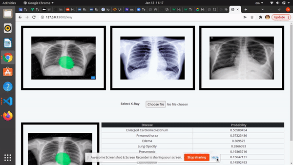

<h1 align="center">
    <b> X-ray Colab ML Model
 </b> 
<br>
</h1>

## What is this for?
This repository give you information about the X-ray image and predicting the diseases of a person. 

## Ngrok
[Ngrok](https://ngrok.com/docs) allows you to expose a web server running on your local machine to the internet. Just tell ngrok what port your web server is listening on.

## Models and technologies used.

This is a pocket application that is mainly focused on aiding medical professionals on their diagnostics and treatments for chest anomalies based on chest X-Rays. On this application, users can upload a chest X-Ray image and a deep learning model will output the probability of 14 different anomalies taking place on that image

## Links to references

Huggingface ML Model

https://huggingface.co/spaces/Rules99/YouRadiologist


## File Path
Here is the file path for Xray Colab ML Model.
```/Xray Colab API/XrayColab.ipynb```

You can use the Xray Colab file in your Colab setup

## Installation
```pip install flask-ngrok```

```pip install pyngrok```

```pip install -U flask-cors```

```pip install flask-ngrok```

```! pip install transformers```

## Instruction
First, set up this repository on your local machine or colab.
Installing all dependency in your local machine or colab.
and, authentication you ngrok token. 
 
To run 
run all the jupiter or colab cell

To make changes
at line 2 on ```ngrok authtoken "<_YOUR_NGROK_TOKEN_>"``` this is your ngrok token.


## Laravel and Vue Installation

Clone the Application on your local system.
After cloning the application on your local system use ```cd X-ray-Colab-ML-Model``` command to go to the Cartoon ML model Directory 

Install the default dependencies by running the following command.

```composer update```

```npm install```

## Setting Up Database

First change the default database in ```config/database.php```
Add your database credentials in ```.env``` file.
Run ```php artisan migrate``` to setup your database migration.


## To start your Local server


```npm run dev```

```php artisan serve```


## To Add your Ngrok link 


Open your local server and go to this path:

```http://127.0.0.1:8000/linkadd```


## Sample Video 




## Contributing

If you want to contribute to a project and make it better, your help is very welcome. Contributing is also a great way to learn more about social coding on Github, new technologies and and their ecosystems and how to make constructive, helpful bug reports, feature requests and the noblest of all contributions: a good, clean pull request.

